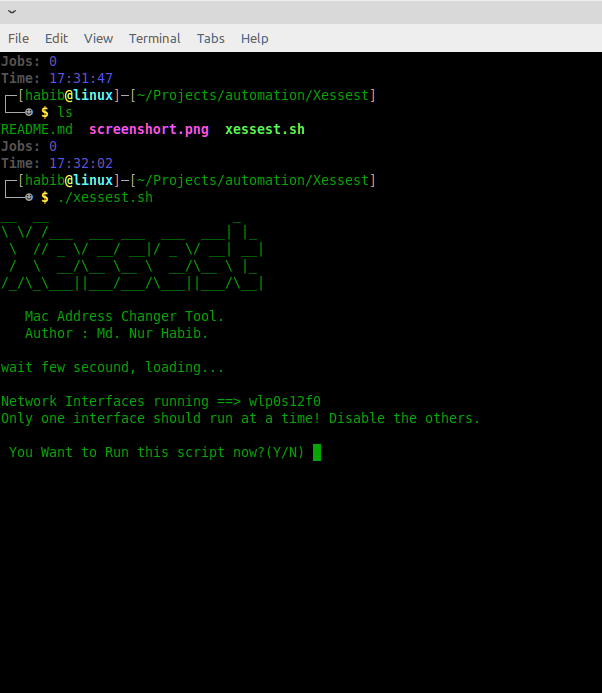

# Xessest

A shell script for linux user. It can help you to change your MAC Address..
This tool made for only educational purpse, please don't use it to harm anyone.

## Usage
`apt-get update`  
`apt-get upgrade`  
`pkg install git`  
`git clone https://github.com/nurhabib1/xessest`  
`cd xessest`  
`chmod +x xessest.sh`  
`./xessest.sh` 

## Screenshot

## 🔗 Links

## 🚀 About Me
I'm a programmer && linux sysadmin.

## Author

- [@Md. Nur habib](https://www.github.com/nurhabib1)

